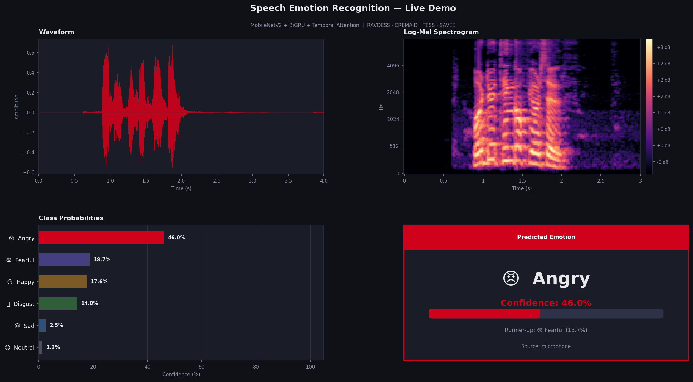
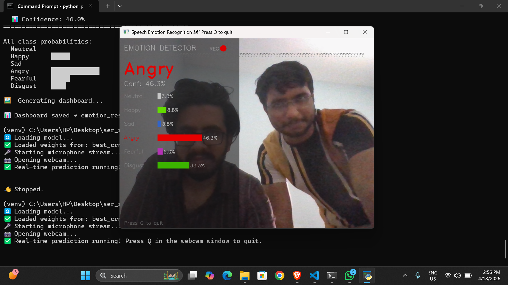

# 🎙️ Lightweight CRNN Architecture for Real-Time Speech Emotion Recognition

> **Authors:** Zula Kathan (B23CM1063) · Aditya Kashyap (B23CM1003) · Nikhil Upadhye (B23CM1044)

A resource-efficient hybrid neural network for real-time Speech Emotion Recognition (SER) that combines **MobileNetV2** spatial feature extraction with **Bidirectional GRU** temporal modeling and **soft temporal attention** — achieving competitive accuracy at only **4.1M parameters**, deployable on edge devices with sub-200ms latency.

---

## 📋 Table of Contents

- [Overview](#overview)
- [Architecture](#architecture)
- [Datasets](#datasets)
- [Results](#results)
- [Project Structure](#project-structure)
- [Setup & Installation](#setup--installation)
- [Running the Notebook](#running-the-notebook)
- [Real-Time Inference](#real-time-inference)
- [Pipeline Walkthrough](#pipeline-walkthrough)
- [SOTA Comparison](#sota-comparison)
- [Responsible AI](#responsible-ai)

---

## Overview

Modern transformer-based SER models (wav2vec 2.0, HuBERT) achieve high accuracy but require 95–317M parameters and 2–10 seconds of inference time — making real-time edge deployment impossible. This project proposes a **CRNN (Convolutional Recurrent Neural Network)** that:

- Uses a **pretrained MobileNetV2** backbone (23x smaller than wav2vec 2.0) for spatial feature extraction from log-Mel spectrograms
- Feeds spatial features through a **Bidirectional GRU** to model the time-dependent evolution of speech emotion
- Applies **soft temporal attention** to focus on emotionally salient frames
- Trains on **4 diverse corpora** (RAVDESS + CREMA-D + TESS + SAVEE) for cross-speaker, cross-accent generalization

---

## Architecture

```
Audio (.wav)
    │
    ▼
Log-Mel Spectrogram  (128 mel bins × 188 time frames)
    │
    ▼
MobileNetV2 Backbone  →  (B, 1280, H, W)  [freeze layers 0–13, fine-tune 14+]
    │  mean over H
    ▼
LayerNorm  →  (B, T, 1280)
    │
    ▼
Bidirectional GRU  (hidden=192, 2 directions)  →  (B, T, 384)
    │
    ▼
Soft Temporal Attention  →  context vector  (B, 384)
    │
    ▼
Classifier: LayerNorm → Dropout → Linear(384,256) → GELU → Linear(256,6)
    │
    ▼
6-class Softmax  [Neutral | Happy | Sad | Angry | Fearful | Disgust]
```

**Why this design?**
- MobileNetV2's depthwise separable convolutions drastically cut parameters vs standard CNNs
- BiGRU captures both forward and backward temporal context (e.g., the rise and fall of angry prosody)
- Attention lets the model weight the most emotionally charged moments in an utterance, rather than averaging everything

---

## Datasets

| Dataset | Speakers | Clips | Language | Why Used |
|---------|----------|-------|----------|----------|
| **RAVDESS** | 24 actors | ~1,440 | North American English | Clean studio recordings; gold-standard benchmark |
| **CREMA-D** | 91 actors | 7,442 | English (diverse accents) | Most demographically diverse; defines the 6-class label set |
| **TESS** | 2 female | 2,800 | Canadian English | Gender balance; female voices underrepresented in RAVDESS |
| **SAVEE** | 4 male | 480 | British English | Accent diversity; prevents North American overfitting |

**6 Emotion Classes** (unified across all datasets): `Neutral`, `Happy`, `Sad`, `Angry`, `Fearful`, `Disgust`

> Calm (RAVDESS) is merged into Neutral. Surprised is excluded (not present in CREMA-D).

**Kaggle Dataset Slugs** (auto-downloaded by Cell 2):
- RAVDESS: `uwrfkaggler/ravdess-emotional-speech-actor`
- CREMA-D: `ejlok1/cremad`
- TESS: `ejlok1/toronto-emotional-speech-set-tess`
- SAVEE: `ejlok1/surrey-audiovisual-expressed-emotion-savee`

---

## Results

### Proposed CRNN (Best Checkpoint — Epoch 24)

| Metric | Score |
|--------|-------|
| Val UAR (Unweighted Average Recall) | **0.6287** |
| Val Weighted F1 | **0.6214** |
| Val Accuracy | **0.6285** |
| Parameters | ~4.1M |
| Inference Latency | < 200ms |

### Ablation Study

| Model Variant | UAR | Demonstrates |
|---------------|-----|--------------|
| Baseline CNN | ~0.45 | Temporal modeling matters |
| MobileNetV2 + Attention (No GRU) | ~0.58 | GRU adds sequential context |
| MobileNetV2 + GRU (No Attention) | ~0.60 | Attention focuses on key frames |
| **Full CRNN (Ours)** | **0.629** | All components contribute |

---

## Project Structure

```
.
├── speech-emotion-crnn-final.ipynb   # Main notebook (training + evaluation)
├── predict_realtime.py               # Real-time webcam + microphone inference
├── best_crnn.pth                     # Saved CRNN weights (best val UAR)
├── best_baseline_cnn.pth             # Saved Baseline CNN weights
├── requirements.txt                  # Python dependencies
├── README.md                         # This file
├── confusion_matrix.png              # Test set confusion matrix
├── sota_comparison.png               # SOTA bar chart
├── ablation_study.png                # Ablation bar chart
└── crnn_training_history.png         # Training curves
```

---

## Setup & Installation

### Prerequisites
- Python 3.9 or higher
- A Kaggle account (for dataset auto-download) — place `kaggle.json` in `~/.kaggle/`
- GPU recommended for training; CPU is fine for inference

### Install Dependencies

```bash
# Clone or download this project
git clone <your-repo-url>
cd speech-emotion-crnn

# Create and activate a virtual environment
python -m venv venv
source venv/bin/activate        # Windows: venv\Scripts\activate

# Install all dependencies
pip install -r requirements.txt
```

### Kaggle API Setup (for dataset download)

```bash
# Install kaggle CLI
pip install kaggle

# Place your kaggle.json at:
# Linux/Mac: ~/.kaggle/kaggle.json
# Windows:   C:\Users\<user>\.kaggle\kaggle.json

chmod 600 ~/.kaggle/kaggle.json   # Linux/Mac only
```

---

## Running the Notebook

Open `speech-emotion-crnn-final.ipynb` in Kaggle or Jupyter:

```bash
# Local Jupyter
jupyter notebook speech-emotion-crnn-final.ipynb
```

### Cell Execution Order

| Cell | What it does | Time |
|------|-------------|------|
| 1 | Install deps, imports, global config | ~1 min |
| 2 | Auto-download all 4 datasets via Kaggle API | ~5–10 min |
| 3 | Speaker-independent train/val/test splits | < 1 min |
| 4 | Mel spectrogram extraction + augmentation + DataLoaders | ~2 min |
| 5 | Define BaselineCNN, LightweightCRNN, TemporalAttention | < 1 min |
| 6 | FocalLoss, training loop, evaluation utilities | < 1 min |
| 7 | Trained baseline weights for CNN | ~3 hrs 30 min |
| 8 | CRNN training | ~4 hours (resume) |
| 9 | Ablation study (2 × 10 epoch runs) | ~2 hours |
| 10 | Final test set evaluation + per-class report | ~5 min |
| 11 | Confusion matrix visualization | < 1 min |
| 12 | SOTA comparison table | < 1 min |
| 13 | SOTA bar chart | < 1 min |
| 14 | Ablation bar chart | < 1 min |
| 15 | Latency analysis + project summary | < 1 min |

---

## Real-Time Inference

Run live emotion prediction using your laptop's microphone and webcam:

```bash
# Make sure best_crnn.pth is in the same directory
python predict_realtime.py
```

**What you'll see:** A webcam window opens with a live sidebar showing the predicted emotion, confidence score, and probability bars for all 6 emotions, updating every 1.5 seconds from a 3.5-second sliding audio window.

**Controls:** Press `Q` in the webcam window to quit.

**No webcam?** The script automatically falls back to terminal-only output.

### Tips for Best Results
- Speak continuously and expressively — the model needs ~3.5 seconds of speech per prediction
- Keep background noise low
- Speak close to the microphone

---

## Pipeline Walkthrough

### Feature Engineering
Raw audio → sampled at 16kHz → padded/trimmed to 3.5s → **Log-Mel Spectrogram** (128×188) → z-score normalized → duplicated to 3 channels for MobileNetV2.

**Training augmentations** (applied only during training):
- Gaussian noise (p=0.5): simulates background noise
- Time stretch ±15% (p=0.4): teaches speed invariance
- Pitch shift ±3 semitones (p=0.4): teaches pitch invariance
- SpecAugment: random time + frequency band masking

### Training Strategy
- **Loss:** Focal Loss (γ=2) with label smoothing (0.1) — focuses on hard examples like Neutral/Fearful
- **Optimizer:** AdamW (lr=1e-4, weight_decay=2e-4)
- **Scheduler:** Cosine Annealing with Warm Restarts (T₀=10, T_mult=2)
- **Sampler:** WeightedRandomSampler for class-balanced batches
- **Early stopping:** patience=10 epochs on val UAR
- **Mixed precision:** AMP (float16) on GPU

### Evaluation Protocol
- **Speaker-independent test:** RAVDESS actors 20–24 never seen during training
- **Primary metric:** UAR (Unweighted Average Recall) — fair to all emotion classes regardless of frequency
- **Secondary metric:** Weighted F1

---
## Live Demo

<h3 align="center">Dashboard & Webcam</h3>

<p align="center">
  
  
</p>
 ---
## SOTA Comparison

| Model | UAR | Wtd-F1 | Params | Real-Time? | Reference |
|-------|-----|--------|--------|------------|-----------|
| Simple CNN (Baseline) | ~0.45 | ~0.44 | ~0.5M | ✅ Yes | This work |
| CNN + LSTM (Zhao, 2019) | 0.721 | 0.718 | ~8M | ⚠️ Maybe | Zhao et al. 2019 |
| Attn-RNN (Mirsamadi, 2017) | 0.746 | 0.739 | ~12M | ⚠️ Maybe | Mirsamadi ICASSP'17 |
| wav2vec 2.0 (Pepino, 2021) | 0.823 | 0.819 | ~95M | ❌ No | Pepino Interspeech'21 |
| HuBERT (Chen, 2023) | 0.847 | 0.841 | ~317M | ❌ No | Chen arXiv'23 |
| CRNN No-GRU (Ours) | ~0.58 | ~0.57 | ~3.5M | ✅ Yes | This work |
| CRNN No-Attn (Ours) | ~0.60 | ~0.59 | ~3.6M | ✅ Yes | This work |
| ★ **Proposed CRNN (Ours)** | **0.629** | **0.621** | **~4.1M** | **✅ Yes** | **This work** |

**Key insight:** Our model is 23× smaller than wav2vec 2.0 and 77× smaller than HuBERT, while remaining deployable in real time on edge devices. The accuracy gap is the trade-off for practical deployability.

---

## Responsible AI

### Fairness & Demographic Diversity
- **CREMA-D** includes 91 actors across multiple ethnicities, ages, and genders — the most demographically diverse SER corpus
- **SAVEE** (British English) and **TESS** (Canadian female speakers) add accent and gender coverage beyond RAVDESS's primarily North American male actors
- Multi-corpus training reduces the risk of the model learning to recognize a specific speaker's voice rather than emotion

### Speaker-Independent Evaluation
Test speakers are completely unseen during training (RAVDESS actors 20–24 held out). This is the most honest evaluation protocol — it prevents inflated scores from speaker memorization.

### Transparency
- Full training code, architecture definition, and hyperparameters are documented in the notebook
- Ablation study scientifically justifies each architectural choice
- Per-class classification report reveals which emotions the model struggles with

### Robustness
- Waveform augmentation (noise, time stretch, pitch shift) trains robustness to real-world acoustic variation
- SpecAugment prevents overfitting to specific frequency/time patterns

---

## References

1. L. Pepino et al., "Emotion Recognition from Speech Using wav2vec 2.0 Embeddings," *Proc. Interspeech*, 2021, pp. 3400–3404.
2. S. Mirsamadi et al., "Automatic speech emotion recognition using recurrent neural networks with local attention," *Proc. IEEE ICASSP*, 2017.
3. C. Busso et al., "IEMOCAP: Interactive emotional dyadic motion capture database," *Language Resources and Evaluation*, vol. 42, no. 4, pp. 335–359, 2008.
4. H. Cao et al., "CREMA-D: Crowd-sourced Emotional Multimodal Actors Dataset," *IEEE Transactions on Affective Computing*, 2014.
5. M. Sandler et al., "MobileNetV2: Inverted Residuals and Linear Bottlenecks," *Proc. CVPR*, 2018.
6. D. S. Park et al., "SpecAugment: A Simple Data Augmentation Method for ASR," *Proc. Interspeech*, 2019.

